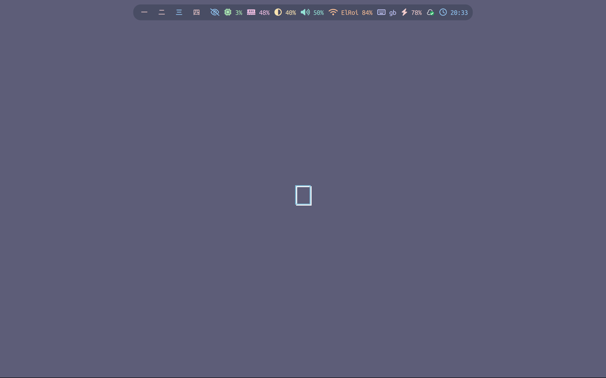
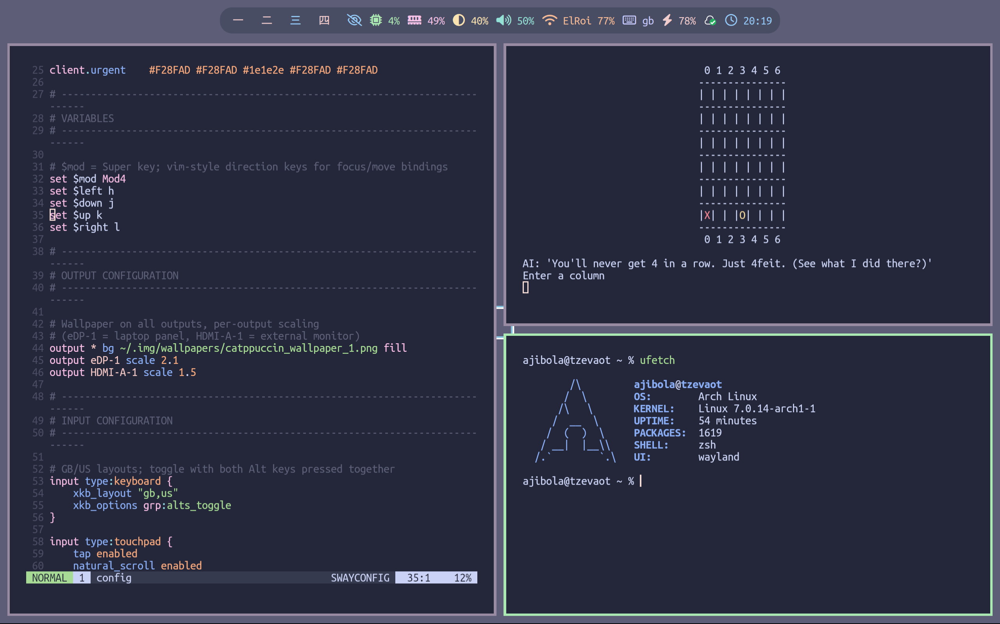
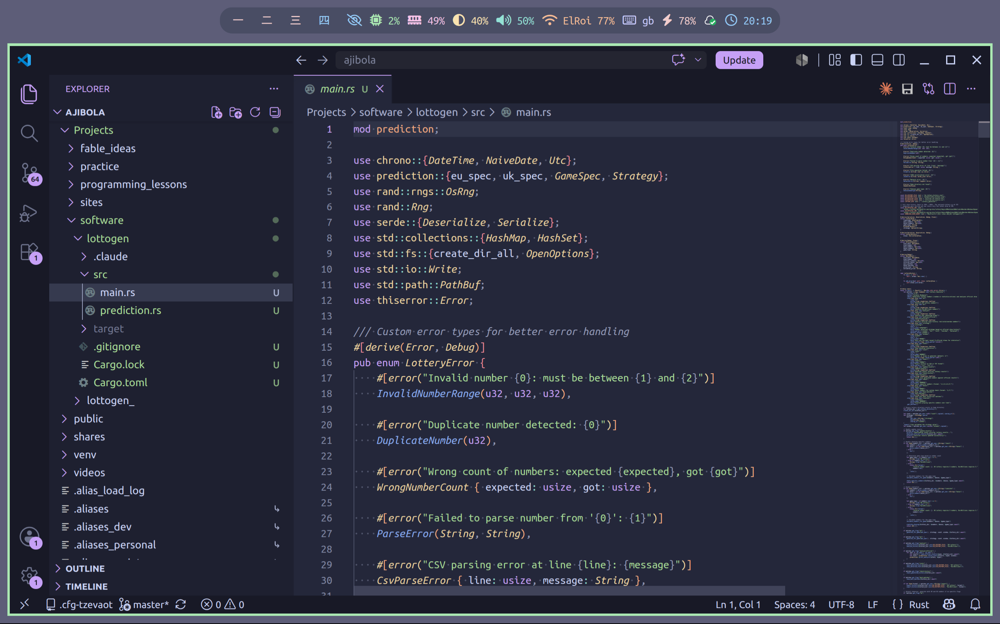
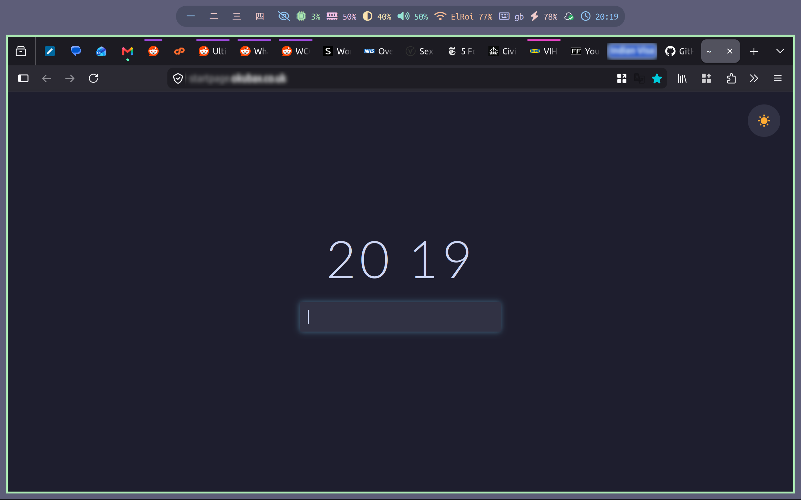

# Dotfiles - Sway Desktop Environment

A complete keyboard-driven desktop setup for Arch Linux featuring the Sway Wayland compositor, Waybar status bar, and productivity-focused applications. Themed throughout with [Catppuccin](https://github.com/catppuccin).

## Screenshots






## Components

**Core Desktop (all Wayland-native)**
- **Window Manager**: Sway (i3-compatible Wayland compositor)
- **Status Bar**: Waybar
- **Launcher / Menus**: Wofi (app launcher, power menu, clipboard picker)
- **Terminal**: Kitty
- **Notifications**: Mako
- **Lock Screen**: Swaylock (blurred wallpaper + clock) with swayidle (auto-lock, lock on suspend)
- **Clipboard**: cliphist + wl-clipboard (history picker bound to Alt+h)
- **Screenshots**: swayshot (full screen / window / region)
- **Shell**: ZSH with modular configuration

**Waybar modules**
- Workspace switcher (Japanese numerals, only occupied workspaces shown)
- MPD now-playing (hidden when nothing is queued; click to play/pause)
- Idle inhibitor, CPU, memory, backlight (scroll to adjust)
- PulseAudio/PipeWire volume (click to mute, scroll to adjust)
- Network (SSID + signal strength, IP in tooltip)
- Keyboard layout (gb/us, click to switch), battery, system tray, clock with calendar

**Applications**
- **Music**: MPD + ncmpcpp + mpc
- **File Managers**: ranger (terminal), thunar (GUI)
- **Text Editor**: vim with native packages (`vim/pack`)
- **IRC**: ii + stunnel + multitail (see `bin/ii-start`, `bin/ii-sway`)
- **Todo**: todo.txt with a conky overlay (`todo/`)

**Theming**
- **Wallpaper**: Generated using `bin/catppuccin_wallpaper.py` script
- **GTK**: Catppuccin theme via [catppuccin/gtk](https://github.com/catppuccin/gtk)
- **Qt**: Configured using qt5ct and qt6ct
- **Theme Tools**: nwg-look for GTK3/4 theme management

## Installation

### Prerequisites
Arch Linux (other distributions require package name adjustments)

### Quick Setup
```bash
git clone https://github.com/okubax/dotfiles.git ~/dotfiles && ~/dotfiles/bootstrap.sh
```

### Manual Installation
```bash
git clone https://github.com/okubax/dotfiles.git ~/dotfiles
cd ~/dotfiles
./bootstrap.sh status   # See what will be linked
./bootstrap.sh link     # Create the symlinks (default command)
```

## Required Packages

### Essential
```bash
sudo pacman -S sway waybar mako swaylock swayidle wofi wl-clipboard cliphist kitty zsh ranger vim
sudo pacman -S brightnessctl playerctl ttf-ubuntu-font-family ttf-font-awesome noto-fonts noto-fonts-emoji
```

### Optional
```bash
sudo pacman -S mpd mpc ncmpcpp pipewire pipewire-pulse wireplumber   # Music / audio
sudo pacman -S gsimplecal qalculate-gtk thunar neofetch              # Desktop utilities
sudo pacman -S qt5ct qt6ct nwg-look                                  # Theme management tools
yay -S multitail swayshot sway-audio-idle-inhibit-git                # AUR
```

## Commands

```bash
./bootstrap.sh                 # Link all configs (default command)
./bootstrap.sh status          # Show LINKED / WRONG / CONFLICT / MISSING per entry
./bootstrap.sh check           # Drift check: warn about live symlinks missing from the map
./bootstrap.sh unlink          # Remove the symlinks it manages
./bootstrap.sh --dry-run       # Preview actions without changing anything
./bootstrap.sh --force         # Replace existing files without keeping a backup
./bootstrap.sh --quiet         # Only print warnings and errors
./bootstrap.sh help            # Full usage
```

`link` is the single source of truth for what gets symlinked; run `check` after
adding a new dotfile to confirm the map still matches reality.

## Post-Installation

1. Set ZSH as default shell: `chsh -s $(which zsh)`
2. Log in on tty1 — `zsh/zprofile` starts Sway automatically (or run `sway` manually)
3. Machine-local secrets (API keys etc.) go in `~/.zshrc.local`, which is sourced by `zsh/zshrc` but not tracked here

## Configuration

### Key Files
- **Sway**: `swaywm/sway/config`
- **Waybar**: `swaywm/waybar/config` + `swaywm/waybar/style.css`
- **Terminal**: `kitty/kitty.conf`
- **Shell**: `aliases/aliases*`
- **ZSH**: `zsh/config/`

### Directory Structure
```
~/dotfiles/
├── bootstrap.sh         # Symlink manager (link/unlink/status/check)
├── aliases/             # Shell aliases (system/dev/personal/scripts)
├── bin/                 # Custom scripts (see below)
├── ii/                  # ii IRC credentials template
├── kitty/               # Terminal config
├── mpd/                 # Music Player Daemon
├── ncmpcpp/             # Music player client
├── ranger/              # File manager
├── startpage/           # Browser start page
├── swaywm/              # Sway, Waybar, Mako, Swaylock, Wofi configs
├── todo/                # todo.txt + conky overlay
├── vim/                 # Editor configuration (native packages)
└── zsh/                 # Shell configuration
    ├── config/          # Modular ZSH configs
    └── plugins/         # Syntax highlighting themes
```

### Adding a dotfile / keeping the map honest
The symlink map lives in a single `LINKS` block inside `bootstrap.sh`. When you
add a new config, drop the file in the repo, add one `repo/path|$HOME/path` line
to that block, then run `./bootstrap.sh check`. It compares the map against the
symlinks actually present in `$HOME` and flags anything missing (so the map can
never silently drift from reality), plus any map entry whose repo source is gone.
Follow with `./bootstrap.sh link` to create the new symlink.

### Notable Scripts in `bin/`
- `ii-start` / `ii-sway` - manage the ii IRC client and its Sway/wofi integration
- `deploy_websites.sh` / `godaddy-server-backup.sh` - static site deployment and full server-home backup (configured via config file/env vars)
- `btrfs-snapshot-backup.sh` / `borg-system-backup.sh` - btrfs snapshot+send backups and Borg full-system backups
- `filesearch.py` - file search tool
- `sysglance.sh` - system overview at a glance (host/CPU/memory/GPU/storage/network/power)
- `space-report.sh` - disk usage (top dirs/files) + installed-package sizes (repo vs AUR)
- `news_reader.py` - terminal RSS reader
- `catppuccin_wallpaper.py` - wallpaper generator

## ZSH Configuration

Modular setup with separate configuration files:
- `history.zsh` - Command history settings
- `options.zsh` - Shell behavior options
- `completion.zsh` - Tab completion system
- `prompt.zsh` - Command prompt
- `aliases.zsh` - ZSH-specific aliases
- `plugins.zsh` - Plugin management

Includes Catppuccin syntax highlighting themes (frappe, latte, macchiato, mocha).

## Backup System

`bootstrap.sh link` never clobbers your data. Anything real that is in the way of
a symlink is first moved into a timestamped `~/.dotfiles-backup-<timestamp>/`
directory (preserving its relative path), then the symlink is created. Wrong-target
symlinks are simply replaced. To undo an install, run `./bootstrap.sh unlink` and,
if needed, move the originals back from that backup directory. Pass `--force` to
skip the backup and overwrite in place, or `--dry-run` to preview first.

## What's Not Included

For security reasons, the following are excluded:
- SSH keys and server configurations
- Email setup, credentials and GPG keys
- Password manager databases
- Personal scripts with sensitive information

Files like `ii/credentials`, `gitconfig`, and the server-related scripts ship with placeholder values — fill in your own.

## Troubleshooting

**Missing file warnings**: Normal for public repositories. Run `./bootstrap.sh status` (a missing source shows as `NO-SRC`) or `./bootstrap.sh check` to audit the map.

**Undo installation**: Run `./bootstrap.sh unlink`, then restore any originals from `~/.dotfiles-backup-<timestamp>/`

**Sway won't start**: Check dependencies and logs with `journalctl --user -u sway`

**Waybar shows no icons**: Install `ttf-font-awesome` (the bar uses Font Awesome 6 glyphs)

**Permission errors**: Run `chmod +x ./bootstrap.sh`

## Customization

Fork the repository and modify configurations to your needs. The modular structure allows easy customization of individual components without affecting the entire setup.

## License

MIT License. Use, modify, and distribute freely.

## Links

- [Sway Documentation](https://github.com/swaywm/sway/wiki)
- [Waybar Configuration](https://github.com/Alexays/Waybar/wiki)
- [Arch Linux Installation Guide](https://wiki.archlinux.org/title/Installation_guide)
- [Improved ii IRC Setup](https://okubax.co.uk/2025/06/16/improved-ii-irc-setup/) - Guide for setting up ii IRC client
