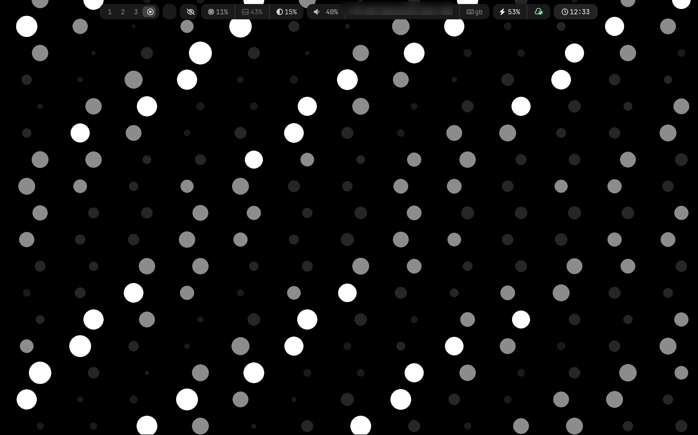
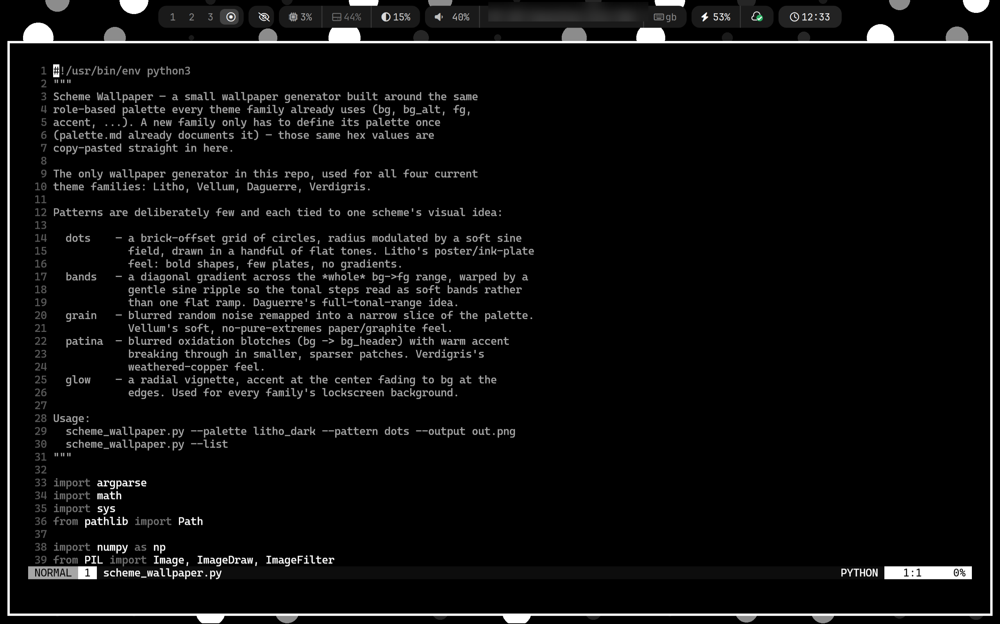
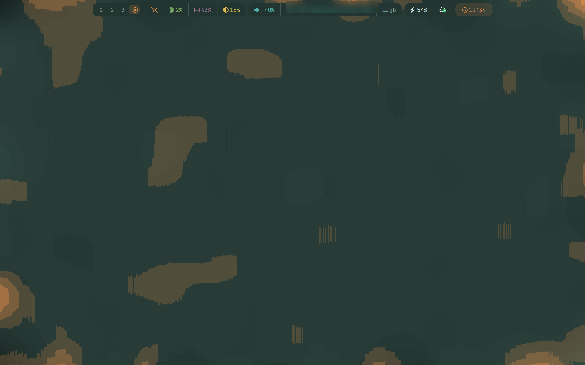
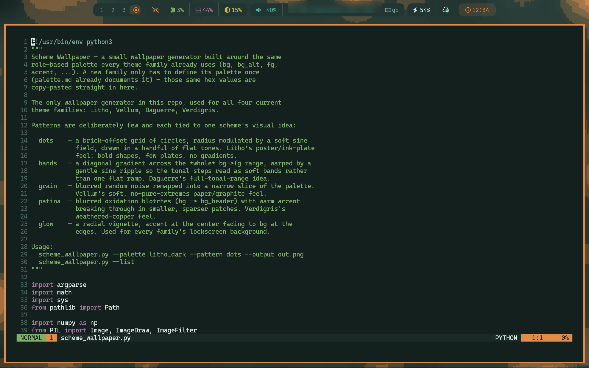

# Dotfiles: Sway Desktop Environment

A complete keyboard-driven desktop setup for Arch Linux featuring the Sway Wayland compositor, Waybar status bar, and productivity-focused applications. Theming is deliberately minimal: four original colorschemes, all built from scratch for this repo (none are ports), each with full sway/waybar/mako/wofi/swaylock/kitty/vim coverage. **[Litho](swaywm/litho/README.md)** (strictly grayscale, stark and high-contrast, poster-like), **[Vellum](swaywm/vellum/README.md)** (strictly grayscale, soft and muted, no pure black/white), **[Daguerre](swaywm/daguerre/README.md)** (strictly grayscale, a full smooth 0–255 tonal ramp, photographic), and **[Verdigris](swaywm/verdigris/README.md)** (the one full-color family, an oxidized-copper/patina palette).

## Screenshots

Desktop and vim, Litho Dark and Verdigris Dark side by side.






## Components

**Core Desktop (all Wayland-native)**
- **Window Manager**: Sway (i3-compatible Wayland compositor)
- **Status Bar**: Waybar
- **Launcher / Menus**: Wofi (app launcher, power menu, clipboard picker)
- **Terminal**: Kitty
- **Notifications**: Mako
- **Lock Screen**: Swaylock (plain wallpaper, theme-colored indicator ring matching whichever of the four colorschemes is active: accent typing, warning-color verifying, red wrong password, purple/violet Caps Lock) with swayidle (auto-lock, lock on suspend). Uses vanilla swaylock; blur/clock require the swaylock-effects fork instead.
- **Clipboard**: cliphist + wl-clipboard (history picker bound to Alt+h)
- **Screenshots**: swayshot (full screen / window / region)
- **Shell**: ZSH with modular configuration

**Waybar modules**
- Workspace switcher (only occupied workspaces shown)
- MPD now-playing (hidden when nothing is queued; click to play/pause)
- Idle inhibitor, CPU, memory, backlight (scroll to adjust)
- PulseAudio/PipeWire volume (click to mute, scroll to adjust)
- Network (SSID + signal strength, IP in tooltip)
- Keyboard layout (gb/us, click to switch), battery, system tray, clock with calendar

**Applications**
- **Web Browsers**: Firefox, Firefox Developer Edition, Google Chrome, Tor Browser
- **File Managers**: ranger (terminal), Dolphin (GUI)
- **Text Editors**: vim (native packages, `vim/pack`), Kate
- **Music**: MPD + ncmpcpp + mpc
- **Calendar / Calculator**: gsimplecal, qalculate-qt
- **Cloud Sync**: Nextcloud client
- **IRC**: ii + stunnel + multitail (see `bin/ii-start`, `bin/ii-sway`)

**Theming**
- **Colorscheme**: [Verdigris](swaywm/verdigris/README.md) (default), dark and light variants, an original oxidized-copper/patina palette, applied consistently across sway, waybar, mako, wofi, swaylock, kitty, and vim. Switch both variants at once with `verdigris-theme dark|light|toggle` (installed to `~/bin`, see `bin/verdigris-theme`), or set `vim`/`kitty` independently by editing their own config.
- **Alternative themes**, same full coverage and shape as Verdigris: three original, strictly grayscale schemes:
  - [Litho](swaywm/litho/README.md): a small set of flat plates with big jumps between them, extremes (`#000000`/`#FFFFFF`) reserved for bg/fg/accent. Stark and poster-like. `litho-theme dark|light|toggle`.
  - [Vellum](swaywm/vellum/README.md): a narrow, compressed range that never touches pure black or pure white, even for `accent`. Soft and muted. `vellum-theme dark|light|toggle`.
  - [Daguerre](swaywm/daguerre/README.md): spans the full 0–255 range in one smooth ramp, loosely inspired by the photographic zone system. `daguerre-theme dark|light|toggle`.

  All four families are **dark/light only**, with no dusk variant. Only one theme *family* drives sway/mako/waybar/wofi's chrome at a time; whichever `<family>-theme` script ran most recently rewrites the shared include paths to point at itself. kitty and vim are unaffected: every family's variants sit side by side as ordinary toggle/colorscheme options, so kitty/vim can be on a different family than the rest of the desktop.
- **Wallpaper**: generated with `bin/scheme_wallpaper.py`, built around each family's role-based palette (`bg`/`fg`/`accent`/...), the same roles each `palette.md` already documents. Desktop wallpapers and swaylock backgrounds for all four ship pre-generated in `img/wallpapers/`.
- **GTK**: `breeze-gtk` (Breeze widget theme for GTK2/3), set via `gtk-3.0`/`gtk-4.0` `settings.ini` (`gtk-theme-name=Breeze`, `gtk-icon-theme-name=breeze`, `gtk-cursor-theme-name=breeze_cursors`), a neutral widget theme independent of which of the four colorschemes above is active
- **Qt**: `breeze5` (Qt5 Breeze style) via qt5ct/qt6ct
- **KDE color schemes**: each theme family ships a matching KDE Frameworks color scheme (`swaywm/<family>/<variant>/<Family><Variant>.colors`, e.g. `swaywm/verdigris/dark/VerdigrisDark.colors`), generated straight from that variant's `palette.md` so KDE apps (Okular, Dolphin, etc.) match the active desktop palette. Once the `.colors` files are symlinked/copied into `~/.local/share/color-schemes/`, each `<family>-theme` script applies the matching one automatically via `plasma-apply-colorscheme <Family><Variant>` on every switch, so switching sway themes switches this too. Requires `QT_QPA_PLATFORMTHEME=kde` (via `plasma-integration`) for full KDE Frameworks apps to pick up `kdeglobals`, not `qt5ct`/`qt6ct`. Gotcha: `plasma-apply-colorscheme` tracks the active scheme by *name*, not file content; if you hand-edit a `.colors` file without renaming it, it won't notice the content changed, so force a refresh by applying a different scheme and back.
- **Icons / Cursors**: `breeze-icons`, `breeze-cursors`
- **Theme Tools**: nwg-look for GTK3/4 theme management

## Installation

### Prerequisites
Arch Linux (other distributions require package name adjustments)

### Quick Setup
```bash
git clone https://github.com/okubax/dotfiles.git ~/dotfiles && ~/dotfiles/bootstrap.sh
```

### Manual Installation
```bash
git clone https://github.com/okubax/dotfiles.git ~/dotfiles
cd ~/dotfiles
./bootstrap.sh status   # See what will be linked
./bootstrap.sh link     # Create the symlinks (default command)
```

**The theme system needs one manual fix after cloning.** GTK CSS's `@import`
doesn't expand `~` or `$HOME`, so `swaywm/waybar/style.css` and
`swaywm/wofi/style.css` each carry a placeholder absolute path
(`/home/YOUR_USERNAME/dotfiles/...`) that's shared by all four theme
families, and which family's subdirectory it resolves into just depends on
which `<family>-theme` script last ran. Edit both `@import url(...)`
lines to point at wherever you actually cloned this repo. Waybar will fail
to start (CSS parse error) until you do.

## Required Packages

### Essential
```bash
sudo pacman -S sway waybar mako swaylock swayidle wofi wl-clipboard cliphist kitty zsh ranger vim
sudo pacman -S brightnessctl playerctl ttf-cascadia-code ttf-jetbrains-mono-nerd noto-fonts noto-fonts-emoji
sudo pacman -S breeze breeze-gtk breeze5 breeze-icons breeze-cursors    # GTK/Qt widget theme, independent of the four sway colorschemes
```

### Optional
```bash
sudo pacman -S mpd mpc ncmpcpp pipewire pipewire-pulse wireplumber   # Music / audio
sudo pacman -S gsimplecal qalculate-qt dolphin neofetch              # Desktop utilities
sudo pacman -S kate                                                  # Text editor (GUI)
sudo pacman -S qt5ct qt6ct nwg-look                                  # Theme management tools (set Qt style to breeze in qt5ct/qt6ct)
sudo pacman -S nethogs pacman-contrib trash-cli                      # netusage / sweep helpers
sudo pacman -S python-pillow python-numpy                            # scheme_wallpaper.py
yay -S multitail swayshot sway-audio-idle-inhibit-git                # AUR
```

## Commands

```bash
./bootstrap.sh                 # Link all configs (default command)
./bootstrap.sh status          # Show LINKED / WRONG / CONFLICT / MISSING per entry
./bootstrap.sh check           # Drift check: warn about live symlinks missing from the map
./bootstrap.sh unlink          # Remove the symlinks it manages
./bootstrap.sh --dry-run       # Preview actions without changing anything
./bootstrap.sh --force         # Replace existing files without keeping a backup
./bootstrap.sh --quiet         # Only print warnings and errors
./bootstrap.sh help            # Full usage
```

`link` is the single source of truth for what gets symlinked; run `check` after
adding a new dotfile to confirm the map still matches reality.

```bash
litho-theme dark|light|toggle|status            # Switch the whole desktop to Litho
vellum-theme dark|light|toggle|status           # Switch the whole desktop to Vellum
daguerre-theme dark|light|toggle|status         # Switch the whole desktop to Daguerre
verdigris-theme dark|light|toggle|status        # Switch the whole desktop to Verdigris
```

## Post-Installation

1. Set ZSH as default shell: `chsh -s $(which zsh)`
2. Log in on tty1. `zsh/zprofile` starts Sway automatically (or run `sway` manually)
3. Fix the two theme-system `@import` placeholder paths described above under Installation
4. Machine-local secrets (API keys etc.) go in `~/.zshrc.local`, which is sourced by `zsh/zshrc` but not tracked here

## Configuration

### Key Files
- **Sway**: `swaywm/sway/config`
- **Waybar**: `swaywm/waybar/config` + `swaywm/waybar/style.css`
- **Mako**: `swaywm/mako/config`
- **Wofi**: `swaywm/wofi/config` + `swaywm/wofi/style.css`
- **Swaylock**: `swaywm/swaylock/config`
- **Terminal**: `kitty/kitty.conf`
- **Vim colorscheme**: set near the bottom of `vimrc`
- **Verdigris theme**: `swaywm/verdigris/` (see its own [README](swaywm/verdigris/README.md) for how the dark/light switch is wired, and how all four theme families coexist)
- **Litho theme**: `swaywm/litho/README.md`
- **Vellum theme**: `swaywm/vellum/README.md`
- **Daguerre theme**: `swaywm/daguerre/README.md`
- **Shell**: `aliases/aliases*`
- **ZSH**: `zsh/config/`

### Directory Structure
```
~/dotfiles/
├── bootstrap.sh         # Symlink manager (link/unlink/status/check)
├── aliases/             # Shell aliases (system/dev/personal/scripts)
├── bin/                 # Custom scripts (see below)
├── ii/                  # ii IRC credentials template
├── img/wallpapers/      # Desktop + swaylock wallpapers, all four themes
├── kitty/               # Terminal config (colors/ has all four themes' flavors)
├── mpd/                 # Music Player Daemon
├── ncmpcpp/             # Music player client
├── ranger/              # File manager
├── startpage/           # Browser start page
├── swaywm/              # Sway, Waybar, Mako, Swaylock, Wofi configs
│   ├── litho/           # Litho colorscheme (grayscale): dark/, light/ (each with a KDE .colors file too), active -> one of them
│   ├── vellum/          # Vellum colorscheme (grayscale): dark/, light/ (each with a KDE .colors file too), active -> one of them
│   ├── daguerre/        # Daguerre colorscheme (grayscale): dark/, light/ (each with a KDE .colors file too), active -> one of them
│   └── verdigris/       # Verdigris colorscheme (full color): dark/, light/ (each with a KDE .colors file too), active -> one of them
├── vim/                 # Editor configuration (native packages; colors/ has all four themes)
└── zsh/                 # Shell configuration
    └── config/          # Modular ZSH configs
```

`swaywm/{litho,vellum,daguerre,verdigris}/` are deliberately **not** in
`bootstrap.sh`'s symlink map, since sway/mako/waybar/wofi reference whichever
family is active directly at
`~/dotfiles/swaywm/{litho,vellum,daguerre,verdigris}/...` rather than
through a `$HOME` symlink, so all four only work correctly if the repo is
cloned to `~/dotfiles` (as the Installation section above does).

### Adding a dotfile / keeping the map honest
The symlink map lives in a single `LINKS` block inside `bootstrap.sh`. When you
add a new config, drop the file in the repo, add one `repo/path|$HOME/path` line
to that block, then run `./bootstrap.sh check`. It compares the map against the
symlinks actually present in `$HOME` and flags anything missing (so the map can
never silently drift from reality), plus any map entry whose repo source is gone.
Follow with `./bootstrap.sh link` to create the new symlink.

### Notable Scripts in `bin/`
- `litho-theme`: switch the whole desktop between Litho Dark and Light in one command
- `vellum-theme`: switch the whole desktop between Vellum Dark and Light in one command
- `daguerre-theme`: switch the whole desktop between Daguerre Dark and Light in one command
- `verdigris-theme`: switch the whole desktop between Verdigris Dark and Light in one command
- `scheme_wallpaper.py`: wallpaper generator for all four themes' role-based palettes
- `ii-start` / `ii-sway`: manage the ii IRC client and its Sway/wofi integration
- `deploy_websites.sh` / `godaddy-server-backup.sh`: static site deployment and full server-home backup (configured via config file/env vars)
- `btrfs-snapshot-backup.sh` / `borg-system-backup.sh`: btrfs snapshot+send backups and Borg full-system backups
- `filesearch.py`: file search tool
- `sysglance.sh`: system overview at a glance (host/CPU/memory/GPU/storage/network/power)
- `space-report.sh`: disk usage (top dirs/files) plus installed-package sizes (repo vs AUR)
- `netusage`: who's using the network, overall and live up/down, plus per-process rates (via nethogs)
- `sweep`: safe cleaner for caches, trash, journal, and pacman cache (dry-run by default; system parts use sudo)
- `news_reader.py`: terminal RSS reader

## ZSH Configuration

Modular setup with separate configuration files:
- `history.zsh`: command history settings
- `options.zsh`: shell behavior options
- `completion.zsh`: tab completion system
- `prompt.zsh`: command prompt
- `aliases.zsh`: ZSH-specific aliases
- `plugins.zsh`: plugin management

## Backup System

`bootstrap.sh link` never clobbers your data. Anything real that is in the way of
a symlink is first moved into a timestamped `~/.dotfiles-backup-<timestamp>/`
directory (preserving its relative path), then the symlink is created. Wrong-target
symlinks are simply replaced. To undo an install, run `./bootstrap.sh unlink` and,
if needed, move the originals back from that backup directory. Pass `--force` to
skip the backup and overwrite in place, or `--dry-run` to preview first.

## What's Not Included

For security reasons, the following are excluded:
- SSH keys and server configurations
- Email setup, credentials and GPG keys
- Password manager databases
- Personal scripts with sensitive information

Files like `ii/credentials`, `gitconfig`, and the server-related scripts ship with placeholder values, so fill in your own.

## Troubleshooting

**Missing file warnings**: Normal for public repositories. Run `./bootstrap.sh status` (a missing source shows as `NO-SRC`) or `./bootstrap.sh check` to audit the map.

**Undo installation**: Run `./bootstrap.sh unlink`, then restore any originals from `~/.dotfiles-backup-<timestamp>/`.

**Sway won't start**: Check dependencies and logs with `journalctl --user -u sway`

**Waybar fails to start / CSS parse error**: You likely haven't fixed the two `@import` placeholder paths in `swaywm/waybar/style.css` and `swaywm/wofi/style.css` yet. See Installation above.

**Waybar shows no icons**: Install `ttf-jetbrains-mono-nerd`. Waybar's icons are JetBrainsMono Nerd Font glyphs, not Font Awesome (an earlier version of this config used Font Awesome, but Arch's `woff2-font-awesome` package has corrupted glyphs for several codepoints this config uses, so it moved to a Nerd Font instead).

**Permission errors**: Run `chmod +x ./bootstrap.sh`

## Customization

Fork the repository and modify configurations to your needs. The modular structure allows easy customization of individual components without affecting the entire setup.

## License

MIT License. Use, modify, and distribute freely.

## Links

- [Litho colorscheme README](swaywm/litho/README.md): a stark, high-contrast grayscale scheme and how the dark/light switch works
- [Vellum colorscheme README](swaywm/vellum/README.md): a soft, muted grayscale scheme and how the dark/light switch works
- [Daguerre colorscheme README](swaywm/daguerre/README.md): a full-tonal-range grayscale scheme and how the dark/light switch works
- [Verdigris colorscheme README](swaywm/verdigris/README.md): an oxidized-copper full-color scheme and how the dark/light switch works
- [Sway Documentation](https://github.com/swaywm/sway/wiki)
- [Waybar Configuration](https://github.com/Alexays/Waybar/wiki)
- [Arch Linux Installation Guide](https://wiki.archlinux.org/title/Installation_guide)
- [Improved ii IRC Setup](https://okubax.co.uk/2025/06/16/improved-ii-irc-setup/): guide for setting up ii IRC client
