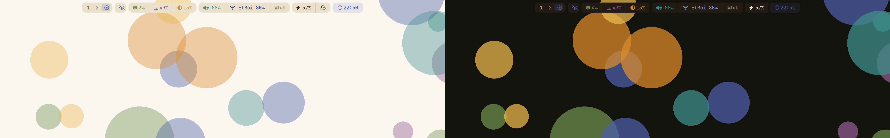
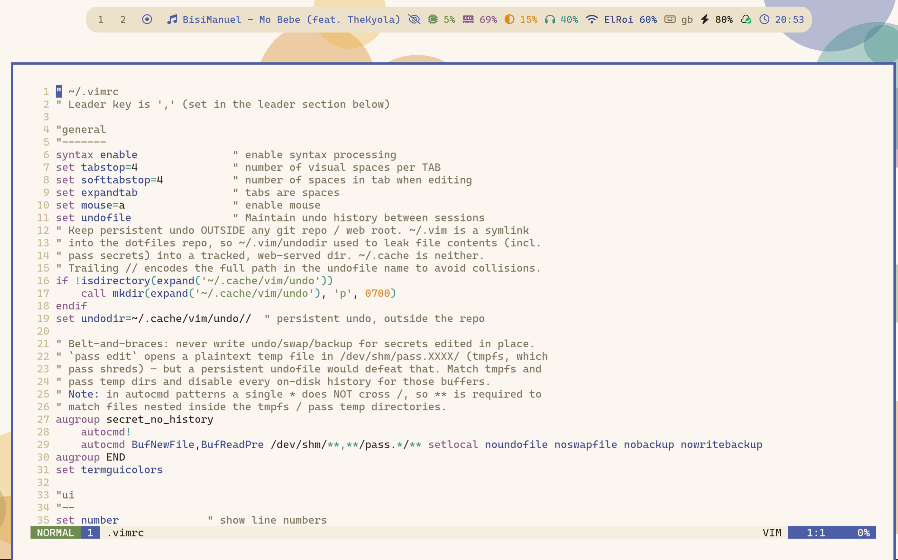
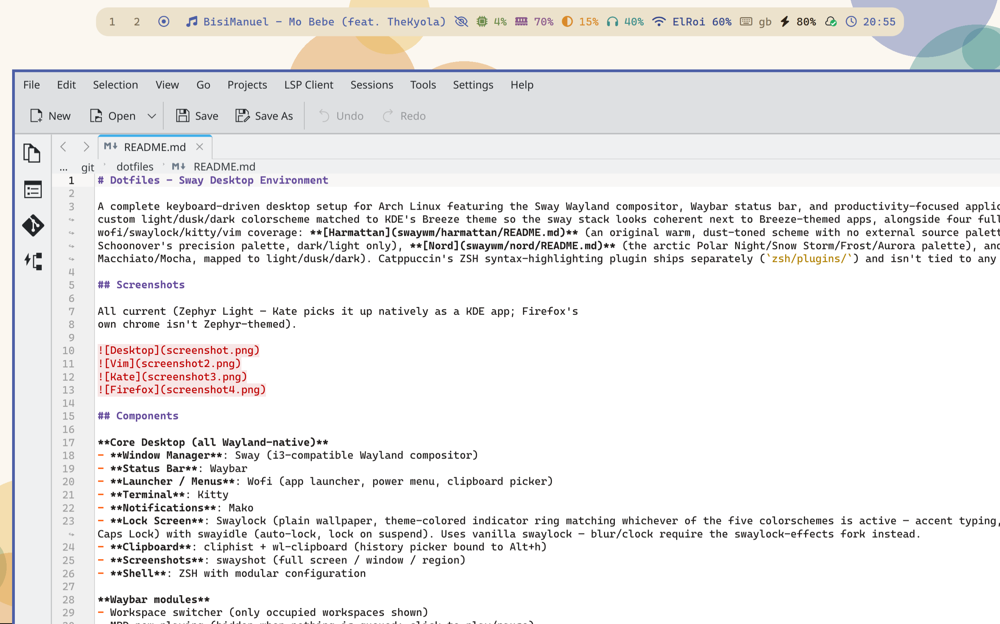

# Dotfiles - Sway Desktop Environment

A complete keyboard-driven desktop setup for Arch Linux featuring the Sway Wayland compositor, Waybar status bar, and productivity-focused applications. Themed with **[Zephyr](swaywm/zephyr/README.md)**, a custom light/dark colorscheme matched to KDE's Breeze theme so the sway stack looks coherent next to Breeze-themed apps. [Catppuccin](https://github.com/catppuccin) flavors (Mocha, Macchiato, Frappé, Latte) ship alongside it as drop-in alternatives for kitty, vim, and ZSH syntax highlighting.

## Screenshots

All current (Zephyr Light — Kate picks it up natively as a KDE app; Firefox's
own chrome isn't Zephyr-themed).






## Components

**Core Desktop (all Wayland-native)**
- **Window Manager**: Sway (i3-compatible Wayland compositor)
- **Status Bar**: Waybar
- **Launcher / Menus**: Wofi (app launcher, power menu, clipboard picker)
- **Terminal**: Kitty
- **Notifications**: Mako
- **Lock Screen**: Swaylock (plain wallpaper, Zephyr-colored indicator ring — blue typing, orange verifying, red wrong password, purple Caps Lock) with swayidle (auto-lock, lock on suspend). Uses vanilla swaylock — blur/clock require the swaylock-effects fork instead.
- **Clipboard**: cliphist + wl-clipboard (history picker bound to Alt+h)
- **Screenshots**: swayshot (full screen / window / region)
- **Shell**: ZSH with modular configuration

**Waybar modules**
- Workspace switcher (Japanese numerals, only occupied workspaces shown)
- MPD now-playing (hidden when nothing is queued; click to play/pause)
- Idle inhibitor, CPU, memory, backlight (scroll to adjust)
- PulseAudio/PipeWire volume (click to mute, scroll to adjust)
- Network (SSID + signal strength, IP in tooltip)
- Keyboard layout (gb/us, click to switch), battery, system tray, clock with calendar

**Applications**
- **Web Browsers**: Firefox, Firefox Developer Edition, Google Chrome, Tor Browser
- **File Managers**: ranger (terminal), Dolphin (GUI)
- **Text Editors**: vim (native packages, `vim/pack`), Kate
- **Music**: MPD + ncmpcpp + mpc
- **Calendar / Calculator**: gsimplecal, qalculate-qt
- **Cloud Sync**: Nextcloud client
- **IRC**: ii + stunnel + multitail (see `bin/ii-start`, `bin/ii-sway`)

**Theming**
- **Colorscheme**: [Zephyr](swaywm/zephyr/README.md) (default) — light and dark variants matched to KDE's Breeze color schemes, applied consistently across sway, waybar, mako, wofi, swaylock, kitty, and vim. Switch both variants at once with `zephyr-theme light|dark|toggle` (installed to `~/bin` — see `bin/zephyr-theme`), or set `vim`/`kitty` independently by editing their own config.
- **Alternatives**: Catppuccin's four flavors remain available for kitty (`kitty/colors/`) and vim (`vim/colors/`); ZSH syntax highlighting is Catppuccin-only (`zsh/plugins/`).
- **Wallpaper**: Generated with `bin/palette_wallpaper.py` — supports both Zephyr's palettes and all four Catppuccin flavors. Zephyr's desktop wallpapers and swaylock backgrounds ship pre-generated in `img/wallpapers/`.
- **GTK**: `breeze-gtk` (Breeze widget theme for GTK2/3) — already matches Zephyr/Breeze natively, no porting needed. Set via `gtk-3.0`/`gtk-4.0` `settings.ini` (`gtk-theme-name=Breeze`, `gtk-icon-theme-name=breeze`, `gtk-cursor-theme-name=breeze_cursors`)
- **Qt**: `breeze5` (Qt5 Breeze style) via qt5ct/qt6ct
- **Icons / Cursors**: `breeze-icons`, `breeze-cursors`
- **Theme Tools**: nwg-look for GTK3/4 theme management

## Installation

### Prerequisites
Arch Linux (other distributions require package name adjustments)

### Quick Setup
```bash
git clone https://github.com/okubax/dotfiles.git ~/dotfiles && ~/dotfiles/bootstrap.sh
```

### Manual Installation
```bash
git clone https://github.com/okubax/dotfiles.git ~/dotfiles
cd ~/dotfiles
./bootstrap.sh status   # See what will be linked
./bootstrap.sh link     # Create the symlinks (default command)
```

**Zephyr needs one manual fix after cloning.** GTK CSS's `@import` doesn't
expand `~` or `$HOME`, so `swaywm/waybar/style.css` and `swaywm/wofi/style.css`
each carry a placeholder absolute path (`/home/YOUR_USERNAME/dotfiles/...`).
Edit both `@import url(...)` lines to point at wherever you actually cloned
this repo — waybar will fail to start (CSS parse error) until you do.

## Required Packages

### Essential
```bash
sudo pacman -S sway waybar mako swaylock swayidle wofi wl-clipboard cliphist kitty zsh ranger vim
sudo pacman -S brightnessctl playerctl ttf-ubuntu-font-family ttf-font-awesome noto-fonts noto-fonts-emoji
sudo pacman -S breeze breeze-gtk breeze5 breeze-icons breeze-cursors    # Zephyr needs these for GTK/Qt apps to match
```

### Optional
```bash
sudo pacman -S mpd mpc ncmpcpp pipewire pipewire-pulse wireplumber   # Music / audio
sudo pacman -S gsimplecal qalculate-qt dolphin neofetch              # Desktop utilities
sudo pacman -S kate                                                  # Text editor (GUI)
sudo pacman -S qt5ct qt6ct nwg-look                                  # Theme management tools (set Qt style to breeze in qt5ct/qt6ct)
sudo pacman -S nethogs pacman-contrib trash-cli                      # netusage / sweep helpers
sudo pacman -S python-pillow python-numpy                            # palette_wallpaper.py
yay -S multitail swayshot sway-audio-idle-inhibit-git                # AUR
```

## Commands

```bash
./bootstrap.sh                 # Link all configs (default command)
./bootstrap.sh status          # Show LINKED / WRONG / CONFLICT / MISSING per entry
./bootstrap.sh check           # Drift check: warn about live symlinks missing from the map
./bootstrap.sh unlink          # Remove the symlinks it manages
./bootstrap.sh --dry-run       # Preview actions without changing anything
./bootstrap.sh --force         # Replace existing files without keeping a backup
./bootstrap.sh --quiet         # Only print warnings and errors
./bootstrap.sh help            # Full usage
```

`link` is the single source of truth for what gets symlinked; run `check` after
adding a new dotfile to confirm the map still matches reality.

```bash
zephyr-theme light|dark|toggle|status   # Switch the whole desktop's colorscheme
```

## Post-Installation

1. Set ZSH as default shell: `chsh -s $(which zsh)`
2. Log in on tty1 — `zsh/zprofile` starts Sway automatically (or run `sway` manually)
3. Fix the two Zephyr `@import` placeholder paths described above under Installation
4. Machine-local secrets (API keys etc.) go in `~/.zshrc.local`, which is sourced by `zsh/zshrc` but not tracked here

## Configuration

### Key Files
- **Sway**: `swaywm/sway/config`
- **Waybar**: `swaywm/waybar/config` + `swaywm/waybar/style.css`
- **Mako**: `swaywm/mako/config`
- **Wofi**: `swaywm/wofi/config` + `swaywm/wofi/style.css`
- **Swaylock**: `swaywm/swaylock/config`
- **Terminal**: `kitty/kitty.conf`
- **Vim colorscheme**: set near the bottom of `vimrc`
- **Zephyr theme**: `swaywm/zephyr/` (see its own [README](swaywm/zephyr/README.md) for how the light/dark switch is wired)
- **Shell**: `aliases/aliases*`
- **ZSH**: `zsh/config/`

### Directory Structure
```
~/dotfiles/
├── bootstrap.sh         # Symlink manager (link/unlink/status/check)
├── aliases/             # Shell aliases (system/dev/personal/scripts)
├── bin/                 # Custom scripts (see below)
├── ii/                  # ii IRC credentials template
├── img/wallpapers/      # Desktop + swaylock wallpapers (Zephyr, Catppuccin)
├── kitty/               # Terminal config (colors/ has Zephyr + Catppuccin flavors)
├── mpd/                 # Music Player Daemon
├── ncmpcpp/             # Music player client
├── ranger/              # File manager
├── startpage/           # Browser start page
├── swaywm/              # Sway, Waybar, Mako, Swaylock, Wofi configs
│   └── zephyr/          # Zephyr colorscheme: light/, dark/, active -> one of them
├── vim/                 # Editor configuration (native packages; colors/ has Zephyr + Catppuccin)
└── zsh/                 # Shell configuration
    ├── config/          # Modular ZSH configs
    └── plugins/         # Catppuccin syntax highlighting themes
```

`swaywm/zephyr/` is deliberately **not** in `bootstrap.sh`'s symlink map —
sway/mako/waybar/wofi reference it directly at `~/dotfiles/swaywm/zephyr/...`
rather than through a `$HOME` symlink, so it only works correctly if the repo
is cloned to `~/dotfiles` (as the Installation section above does).

### Adding a dotfile / keeping the map honest
The symlink map lives in a single `LINKS` block inside `bootstrap.sh`. When you
add a new config, drop the file in the repo, add one `repo/path|$HOME/path` line
to that block, then run `./bootstrap.sh check`. It compares the map against the
symlinks actually present in `$HOME` and flags anything missing (so the map can
never silently drift from reality), plus any map entry whose repo source is gone.
Follow with `./bootstrap.sh link` to create the new symlink.

### Notable Scripts in `bin/`
- `zephyr-theme` - switch the whole desktop between Zephyr Light and Dark in one command
- `palette_wallpaper.py` - wallpaper generator (Zephyr's light/dark palette, or any of the four Catppuccin flavors)
- `ii-start` / `ii-sway` - manage the ii IRC client and its Sway/wofi integration
- `deploy_websites.sh` / `godaddy-server-backup.sh` - static site deployment and full server-home backup (configured via config file/env vars)
- `btrfs-snapshot-backup.sh` / `borg-system-backup.sh` - btrfs snapshot+send backups and Borg full-system backups
- `filesearch.py` - file search tool
- `sysglance.sh` - system overview at a glance (host/CPU/memory/GPU/storage/network/power)
- `space-report.sh` - disk usage (top dirs/files) + installed-package sizes (repo vs AUR)
- `netusage` - who's using the network: overall + live up/down, plus per-process rates (via nethogs)
- `sweep` - safe cleaner for caches / trash / journal / pacman cache (dry-run by default; system parts use sudo)
- `news_reader.py` - terminal RSS reader

## ZSH Configuration

Modular setup with separate configuration files:
- `history.zsh` - Command history settings
- `options.zsh` - Shell behavior options
- `completion.zsh` - Tab completion system
- `prompt.zsh` - Command prompt
- `aliases.zsh` - ZSH-specific aliases
- `plugins.zsh` - Plugin management

Includes Catppuccin syntax highlighting themes (frappe, latte, macchiato, mocha) — not yet ported to Zephyr.

## Backup System

`bootstrap.sh link` never clobbers your data. Anything real that is in the way of
a symlink is first moved into a timestamped `~/.dotfiles-backup-<timestamp>/`
directory (preserving its relative path), then the symlink is created. Wrong-target
symlinks are simply replaced. To undo an install, run `./bootstrap.sh unlink` and,
if needed, move the originals back from that backup directory. Pass `--force` to
skip the backup and overwrite in place, or `--dry-run` to preview first.

## What's Not Included

For security reasons, the following are excluded:
- SSH keys and server configurations
- Email setup, credentials and GPG keys
- Password manager databases
- Personal scripts with sensitive information

Files like `ii/credentials`, `gitconfig`, and the server-related scripts ship with placeholder values — fill in your own.

## Troubleshooting

**Missing file warnings**: Normal for public repositories. Run `./bootstrap.sh status` (a missing source shows as `NO-SRC`) or `./bootstrap.sh check` to audit the map.

**Undo installation**: Run `./bootstrap.sh unlink`, then restore any originals from `~/.dotfiles-backup-<timestamp>/`

**Sway won't start**: Check dependencies and logs with `journalctl --user -u sway`

**Waybar fails to start / CSS parse error**: You likely haven't fixed the two `@import` placeholder paths in `swaywm/waybar/style.css` and `swaywm/wofi/style.css` yet — see Installation above.

**Waybar shows no icons**: Install `ttf-font-awesome` (the bar uses Font Awesome 6 glyphs)

**Permission errors**: Run `chmod +x ./bootstrap.sh`

## Customization

Fork the repository and modify configurations to your needs. The modular structure allows easy customization of individual components without affecting the entire setup.

## License

MIT License. Use, modify, and distribute freely.

## Links

- [Zephyr colorscheme README](swaywm/zephyr/README.md) - palette provenance and how the light/dark switch works
- [Sway Documentation](https://github.com/swaywm/sway/wiki)
- [Waybar Configuration](https://github.com/Alexays/Waybar/wiki)
- [Arch Linux Installation Guide](https://wiki.archlinux.org/title/Installation_guide)
- [Improved ii IRC Setup](https://okubax.co.uk/2025/06/16/improved-ii-irc-setup/) - Guide for setting up ii IRC client
