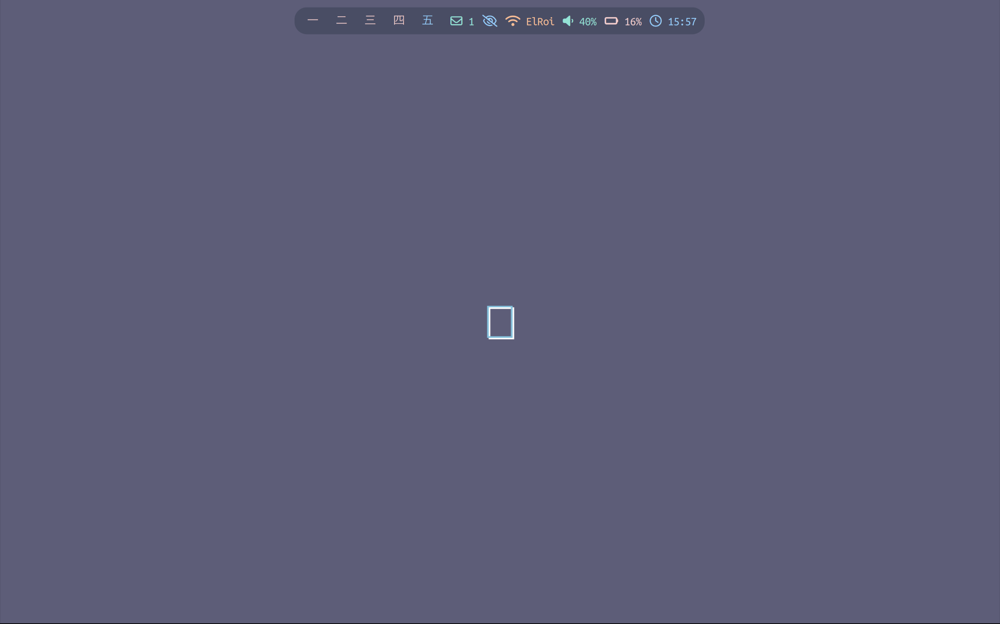

# Dotfiles - Sway Desktop Environment

A complete keyboard-driven desktop setup for Arch Linux featuring Sway compositor, Waybar status bar, and productivity-focused applications.

## Screenshots




## Components

**Core Desktop**
- **Window Manager**: Sway (i3-compatible, Wayland)
- **Status Bar**: Waybar with custom modules
- **Terminal**: Kitty
- **Notifications**: Mako
- **Lock Screen**: Swaylock
- **Shell**: ZSH with modular configuration

**Applications**
- **Email**: mutt + offlineimap templates
- **Music**: MPD + ncmpcpp
- **File Manager**: ranger
- **Text Editor**: vim with plugins

## Installation

### Prerequisites
Arch Linux (other distributions require package name adjustments)

### Quick Setup
```bash
git clone https://github.com/okubax/dotfiles.git ~/dotfiles && ~/dotfiles/dotfiles.sh install
```

### Manual Installation
```bash
git clone https://github.com/okubax/dotfiles.git ~/dotfiles
cd ~/dotfiles
./dotfiles.sh status    # Check what will be installed
./dotfiles.sh install   # Install configurations
```

## Required Packages

### Essential
```bash
sudo pacman -S sway waybar mako swaylock wofi wl-clipboard kitty zsh ranger vim
sudo pacman -S ttf-fira-code noto-fonts noto-fonts-emoji ttf-ubuntu-font-family
```

### Optional
```bash
sudo pacman -S mpd ncmpcpp mpc pipewire pipewire-pulse mutt offlineimap msmtp neofetch
yay -S multitail swayshot
```

## Commands

```bash
./dotfiles.sh install          # Install all configurations
./dotfiles.sh status           # Show installation status
./dotfiles.sh uninstall        # Remove symlinks
./dotfiles.sh backup           # Create backup
./dotfiles.sh restore          # Restore from backup
./dotfiles.sh install --dry-run    # Preview changes
./dotfiles.sh install --force      # Overwrite existing files
```

## Post-Installation

1. Set ZSH as default shell: `chsh -s $(which zsh)`
2. Start Sway: `exec sway` (from TTY) or select from display manager
3. Logout and log back in

## Configuration

### Key Files
- **Sway**: `swaywm/sway/config`
- **Waybar**: `swaywm/waybar/config`
- **Terminal**: `kitty/kitty.conf`
- **Shell**: `aliases/aliases*`
- **ZSH**: `zsh/config/`

### Directory Structure
```
~/dotfiles/
├── dotfiles.sh          # Installation script
├── aliases/             # Shell aliases
├── bin/                 # Custom scripts
├── kitty/               # Terminal config
├── swaywm/              # Sway, Waybar, Mako configs
├── vim/                 # Editor configuration
├── zsh/                 # Shell configuration
│   ├── config/         # Modular ZSH configs
│   └── plugins/        # Syntax highlighting themes
├── ranger/              # File manager
├── ncmpcpp/             # Music player
└── mutt/                # Email client
```

## ZSH Configuration

Modular setup with separate configuration files:
- `history.zsh` - Command history settings
- `options.zsh` - Shell behavior options
- `completion.zsh` - Tab completion system
- `prompt.zsh` - Command prompt
- `aliases.zsh` - ZSH-specific aliases
- `plugins.zsh` - Plugin management

Includes Catppuccin syntax highlighting themes (frappe, latte, macchiato, mocha).

## Backup System

The installation script includes automatic backup functionality:
- Creates backups before overwriting existing configurations
- Manual backup/restore operations available
- Tracks backup metadata and file lists
- Graceful handling of missing files

## What's Not Included

For security reasons, the following are excluded:
- SSH keys and server configurations
- Email credentials and GPG keys
- Password manager databases
- Personal scripts with sensitive information

## Troubleshooting

**Missing file warnings**: Normal for public repositories. Use `./dotfiles.sh status` to see available files.

**Undo installation**: Use `./dotfiles.sh restore` or `./dotfiles.sh uninstall`

**Sway won't start**: Check dependencies and logs with `journalctl --user -u sway`

**Permission errors**: Run `chmod +x ./dotfiles.sh`

## Customization

Fork the repository and modify configurations to your needs. The modular structure allows easy customization of individual components without affecting the entire setup.

## License

MIT License. Use, modify, and distribute freely.

## Links

- [Sway Documentation](https://github.com/swaywm/sway/wiki)
- [Waybar Configuration](https://github.com/Alexays/Waybar/wiki)
- [Arch Linux Installation Guide](https://wiki.archlinux.org/title/Installation_guide)
- [Improved ii IRC Setup](https://okubax.co.uk/2025/06/16/improved-ii-irc-setup/) - Guide for setting up ii IRC client
