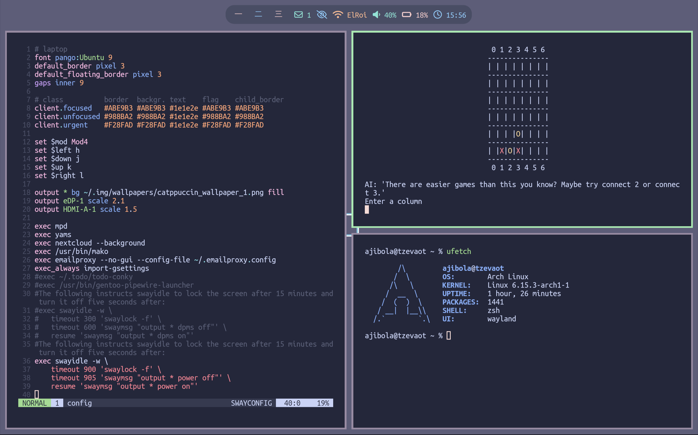

# 🏠 Dotfiles - Modern Wayland Desktop with Sway

> A complete, keyboard-driven desktop environment built for productivity and aesthetics

This repository contains dotfiles for a modern Linux desktop setup featuring **Sway** (Wayland compositor), **Waybar** (status bar), and carefully curated applications. Everything is designed to work harmoniously for a clean, efficient workflow.

## ✨ What You Get

- **🪟 Window Manager**: Sway (i3-compatible, Wayland-native)
- **📊 Status Bar**: Waybar with custom modules
- **🖥️ Terminal**: Kitty with optimized configuration  
- **🎨 Notifications**: Mako notification daemon
- **🔒 Security**: Swaylock configuration
- **📧 Email**: Basic mutt + offlineimap templates
- **🎵 Music**: MPD + ncmpcpp configuration
- **📁 File Management**: Ranger terminal file manager
- **⌨️ Shell**: ZSH with modular configuration and custom aliases
- **🛠️ Utilities**: Custom scripts and productivity tools

## 📸 Preview




*Clean, minimal desktop with Waybar status bar and Sway window management*

---

## 🚀 Quick Installation

### Prerequisites

**Recommended System**: Arch Linux (other distributions may work with package name adjustments)

### One-Command Setup

```bash
# Clone and install in one go
git clone https://github.com/okubax/dotfiles.git ~/dotfiles && ~/dotfiles/dotfiles.sh install
```

### Step-by-Step Installation

```bash
# 1. Clone the repository
git clone https://github.com/okubax/dotfiles.git ~/dotfiles
cd ~/dotfiles

# 2. Preview what will be installed
./dotfiles.sh status

# 3. Install everything
./dotfiles.sh install
```

---

## 📋 Installation Commands

The `dotfiles.sh` script handles everything automatically:

### Basic Commands
```bash
./dotfiles.sh install          # Install all available dotfiles
./dotfiles.sh status           # Check current installation status
./dotfiles.sh uninstall        # Remove all symlinks safely
./dotfiles.sh backup           # Create backup of existing configs
./dotfiles.sh restore          # Restore from most recent backup
```

### Advanced Options
```bash
./dotfiles.sh install --dry-run    # Preview installation without changes
./dotfiles.sh install --force      # Overwrite existing files
./dotfiles.sh install --verbose    # Show detailed output
./dotfiles.sh install --no-backup  # Skip automatic backup during install
./dotfiles.sh backup --dry-run     # Preview what would be backed up
./dotfiles.sh restore [backup_dir] # Restore from specific backup
```

### Backup & Safety Features
- **Automatic backups**: Creates backups before installation by default
- **Manual backups**: Create backups anytime with `backup` command
- **Smart restoration**: Restore from most recent or specific backup
- **Graceful handling**: Missing files show warnings but don't stop installation
- **Interactive prompts**: Choose what to do with existing files
- **Dry-run mode**: See what will happen before making changes
- **Backup tracking**: Remembers last backup location for easy restoration

---

## 📦 Required Packages

### Core Desktop Environment

**On Arch Linux:**
```bash
# Essential Sway desktop
sudo pacman -S sway waybar mako swaylock wofi wl-clipboard

# Terminal and shell
sudo pacman -S kitty zsh

# File management
sudo pacman -S ranger vim

# Fonts (recommended)
sudo pacman -S ttf-fira-code noto-fonts noto-fonts-emoji
```

### Optional Components

```bash
# Audio and media
sudo pacman -S mpd ncmpcpp mpc pipewire pipewire-pulse

# Email (if you want mail setup)
sudo pacman -S mutt offlineimap msmtp

# Additional utilities
sudo pacman -S neofetch git
```

### AUR Packages
```bash
# Using yay or your preferred AUR helper
yay -S multitail swayshot
```

---

## 🔧 Post-Installation Setup

### 1. Set ZSH as Default Shell
```bash
chsh -s $(which zsh)
```

### 2. Configure Sway Session
**Option A: Display Manager**
- Log out of your current session
- Choose "Sway" from your display manager

**Option B: Manual Start**
```bash
# From a TTY
exec sway
```

### 3. Install Additional Fonts (Optional)
```bash
# For better Unicode support and aesthetics
sudo pacman -S ttf-liberation ttf-dejavu
```

### 4. Backup Management

The dotfiles script includes comprehensive backup functionality:

**Automatic Backups:**
```bash
# Backups are created automatically before installation
./dotfiles.sh install
```

**Manual Backup Operations:**
```bash
# Create backup anytime
./dotfiles.sh backup

# Preview what would be backed up
./dotfiles.sh backup --dry-run

# Install without creating backup
./dotfiles.sh install --no-backup
```

**Restore Operations:**
```bash
# Restore from most recent backup
./dotfiles.sh restore

# List available backups
ls -la ~/.dotfiles_backup_*

# Restore from specific backup
./dotfiles.sh restore ~/.dotfiles_backup_20250621_120000

# Preview restore operation
./dotfiles.sh restore --dry-run
```

**Backup Features:**
- **Smart detection**: Only backs up files that would be overwritten
- **Metadata tracking**: Each backup includes creation info and file list
- **Conflict handling**: Automatically handles naming conflicts
- **Easy restoration**: Remember last backup location for quick recovery

### 5. Set Up Private Configurations

Some configurations are not included in this public repository for privacy/security:

**Email Setup** (if desired):
- Copy `msmtprc` and customize with your email settings
- Set up `~/.offlineimaprc` with your email credentials
- Configure GPG for password encryption

**SSH Configuration**:
- Add your SSH keys to `~/.ssh/`
- Configure `~/.ssh/config` for your servers

**Password Management**:
```bash
# If you want to use pass
sudo pacman -S pass
pass init "your-gpg-key-id"
```

---

## 🎨 Customization Guide

### Quick Customizations

| What to Change | Configuration File | Purpose |
|----------------|-------------------|---------|
| **Keybindings** | `swaywm/sway/config` | Window management shortcuts |
| **Status Bar** | `swaywm/waybar/config` | Modules, styling, behavior |
| **Terminal Colors** | `kitty/kitty.conf` | Colors, fonts, transparency |
| **Shell Aliases** | `aliases/aliases*` | Command shortcuts |
| **File Manager** | `ranger/rc.conf` | Key bindings, previews |

### Color Schemes
The setup includes several color schemes and follows XDG Base Directory specifications:
- **Kitty**: Multiple themes in `kitty/colors/`
- **Vim**: Catppuccin variants included
- **ZSH**: Syntax highlighting themes in `~/.local/share/zsh/plugins/`
  - Catppuccin Frappe (warm, muted)
  - Catppuccin Latte (light variant)
  - Catppuccin Macchiato (balanced)
  - Catppuccin Mocha (dark, rich)

### Adding Your Own Configs
1. **Fork this repository**
2. **Add your files** to the appropriate directories
3. **Update the FILES array** in `dotfiles.sh` if needed
4. **Test with dry-run**: `./dotfiles.sh install --dry-run`

---

## 🗂️ Repository Structure

```
~/dotfiles/
├── dotfiles.sh              # Installation script with backup functionality
├── aliases/                 # Shell aliases and functions
├── bin/                     # Custom scripts and utilities
├── fontconfig/              # Font configuration
├── kitty/                   # Terminal configuration
├── mplayer/                 # Media player settings
├── mutt/                    # Email client configuration
├── ncmpcpp/                 # Music player interface
├── ranger/                  # File manager configuration
├── swaywm/                  # Window manager configs
│   ├── sway/               # Sway WM settings
│   ├── waybar/             # Status bar configuration
│   ├── mako/               # Notification daemon
│   └── wofi/               # Application launcher
├── vim/                     # Text editor configuration
├── zsh/                     # Shell configuration
│   ├── config/             # Modular ZSH configs
│   │   ├── history.zsh     # History settings
│   │   ├── options.zsh     # Shell options
│   │   ├── completion.zsh  # Completion system
│   │   ├── prompt.zsh      # Prompt configuration
│   │   ├── aliases.zsh     # ZSH-specific aliases
│   │   └── plugins.zsh     # Plugin management
│   ├── plugins/            # ZSH syntax highlighting themes
│   │   ├── catppuccin_frappe-zsh-syntax-highlighting.zsh
│   │   ├── catppuccin_latte-zsh-syntax-highlighting.zsh
│   │   ├── catppuccin_macchiato-zsh-syntax-highlighting.zsh
│   │   └── catppuccin_mocha-zsh-syntax-highlighting.zsh
│   ├── zprofile           # ZSH profile
│   ├── zshenv             # ZSH environment
│   ├── zshrc              # Main ZSH config (loads modular configs)
│   └── zsh_history        # ZSH command history
└── README.md               # This file
```

### ZSH Plugin Management

The ZSH setup includes a sophisticated plugin system:

- **Plugin Storage**: Themes are stored in `~/.local/share/zsh/plugins/` (following XDG Base Directory spec)
- **Theme Selection**: Multiple Catppuccin syntax highlighting variants included
- **Modular Loading**: Plugin management handled via `zsh/config/plugins.zsh`
- **Easy Switching**: Change themes by updating the plugin configuration

**Available Themes:**
- `catppuccin_frappe` - Warm, muted colors
- `catppuccin_latte` - Light theme variant  
- `catppuccin_macchiato` - Balanced contrast
- `catppuccin_mocha` - Dark, rich colors

---

## ⚠️ Important Notes

### What's NOT Included

For privacy and security, these are **not** in the public repository:

- **Private SSH keys** and server configurations
- **Email credentials** and GPG keys
- **Password manager** databases
- **Personal scripts** with sensitive information
- **System-specific** configurations

### Missing File Handling

The installation script handles missing files gracefully:
- **Warnings** are shown for missing files
- **Installation continues** for available files
- **Status command** shows what's available vs. missing

This is normal and expected for a public dotfiles repository!

---

## 🆘 Troubleshooting

### Common Issues

**"Source not found" warnings:**
```bash
# This is normal! Check what's actually available:
./dotfiles.sh status

# Install only what's available:
./dotfiles.sh install --verbose
```

**Want to undo changes:**
```bash
# Restore from backup
./dotfiles.sh restore

# Or remove all symlinks
./dotfiles.sh uninstall
```

**Need to backup before experimenting:**
```bash
# Create manual backup
./dotfiles.sh backup

# Try changes, then restore if needed
./dotfiles.sh restore
```

**Permission errors:**
```bash
# Make script executable
chmod +x ./dotfiles.sh
```

**Sway won't start:**
```bash
# Install core dependencies first
sudo pacman -S sway waybar mako

# Check Sway logs
journalctl --user -u sway
```

**Fonts look weird:**
```bash
# Install recommended fonts
sudo pacman -S ttf-fira-code noto-fonts
```

### Getting Help

1. **Check the status**: `./dotfiles.sh status`
2. **Use verbose mode**: `./dotfiles.sh install --verbose`
3. **Try dry-run first**: `./dotfiles.sh install --dry-run`
4. **Open an issue** on GitHub for bugs or questions

---

## 🤝 Contributing

### Sharing Improvements
- **Fork the repository** and customize for your needs
- **Open issues** for bugs or feature requests
- **Submit pull requests** for improvements
- **Share screenshots** of your customizations!

### Making It Yours
1. Fork this repository to your GitHub account
2. Modify configurations to match your preferences  
3. Add your own private configs (don't commit sensitive data!)
4. Update the installation script if you add/remove files

---

## 🎯 Similar Setups

If you're looking for inspiration or alternatives:
- **[r/unixporn](https://reddit.com/r/unixporn)** - Desktop customization showcase
- **[Sway Wiki](https://github.com/swaywm/sway/wiki)** - Official documentation
- **[ArchWiki Sway](https://wiki.archlinux.org/title/Sway)** - Comprehensive setup guide

---

## 📄 License

These dotfiles are provided freely under the MIT License. Feel free to use, modify, and share!

**Special thanks to:**
- The [Sway](https://swaywm.org/) development team
- The [Arch Linux](https://archlinux.org/) community  
- All open-source projects that make this setup possible
- The dotfiles community for inspiration and ideas

---

## 🔗 Quick Links

- **[Sway Documentation](https://github.com/swaywm/sway/wiki)**
- **[Waybar Configuration](https://github.com/Alexays/Waybar/wiki)**
- **[Arch Linux Installation Guide](https://wiki.archlinux.org/title/Installation_guide)**
- **[ZSH Configuration Guide](https://wiki.archlinux.org/title/Zsh)**

---

*Happy ricing! 🎉*

> **Pro tip**: Start with the basic installation, then gradually customize each component to your liking. The modular structure makes it easy to modify individual parts without breaking the whole setup.
